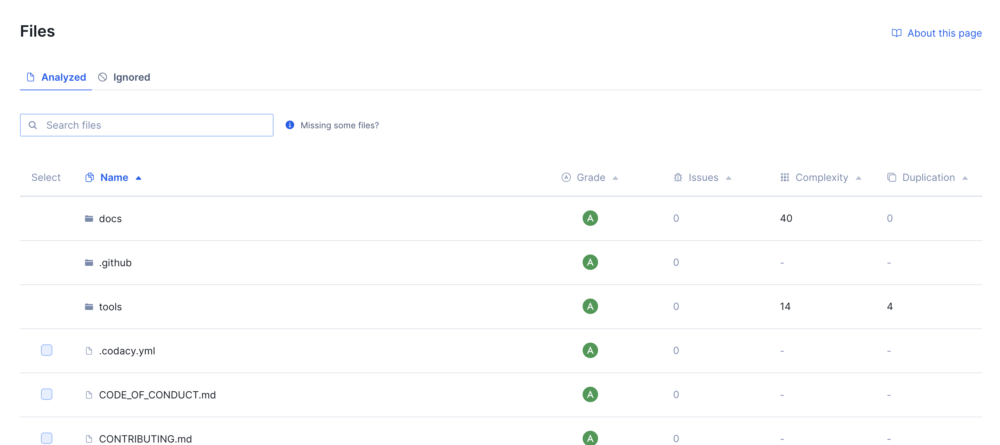
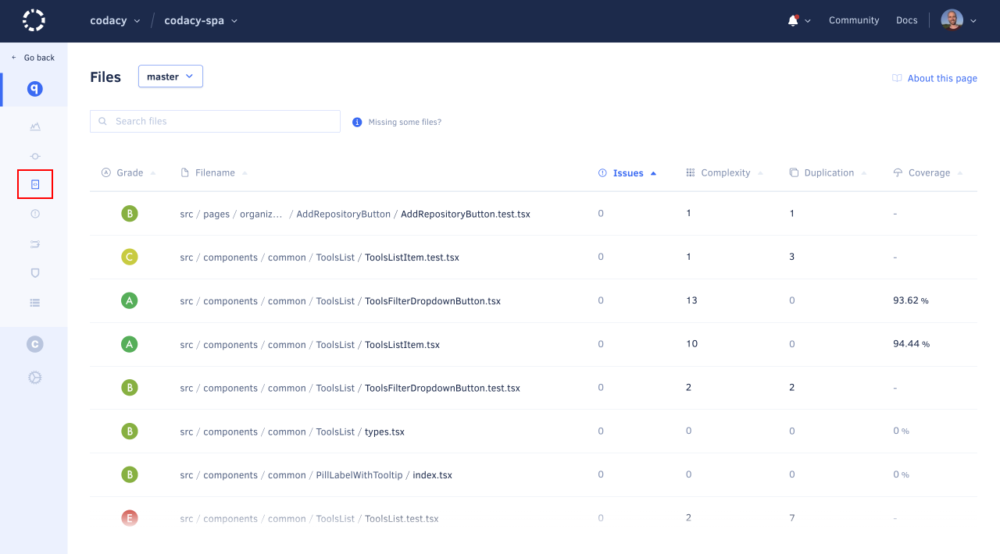
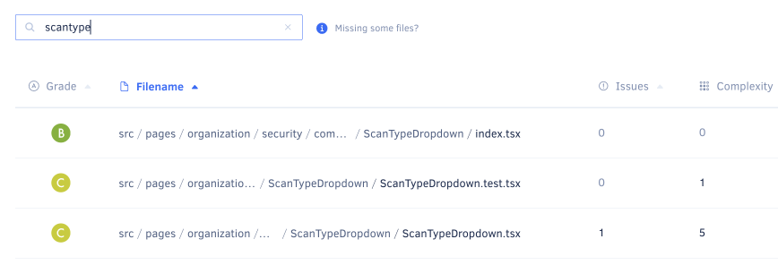
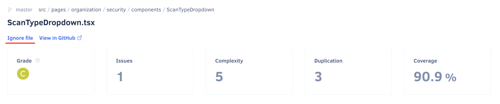
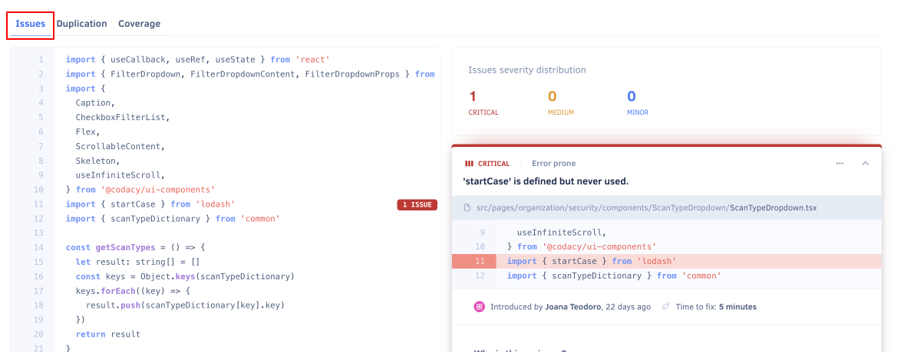
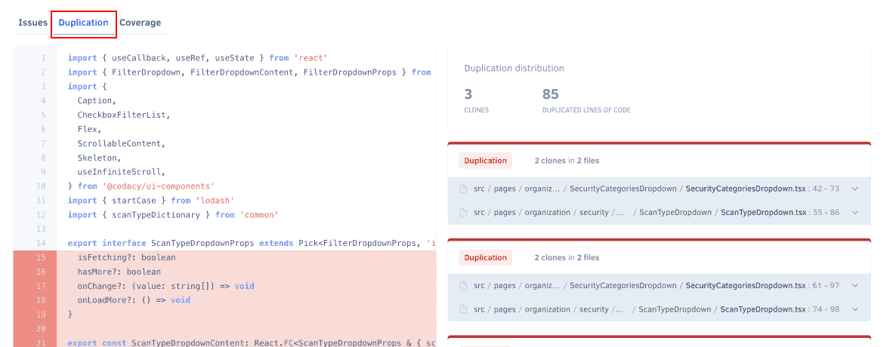
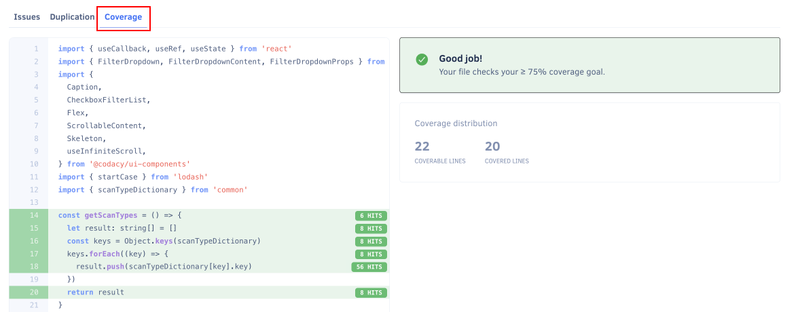

# Files page

The **Files page** displays the current code quality information for each analyzed file and folder in your [enabled repository branches](../repositories-configure/managing-branches.md).

By default, the page lists the contents of the root directory on the main branch of your repository. However, if you have [more than one branch enabled](../repositories-configure/managing-branches.md), you can select other branches using the drop-down list at the top of the page.

## Browsing by folder

The Files page lets you browse your repository by directory. Folders are listed at the top of the table. Click a folder to drill into it and see its contents. Use the breadcrumb trail at the top of the table to navigate back up to any parent directory.

Each directory row shows the aggregated quality metrics for the current folder — across all files it contains, including files in nested subdirectories.

!!! note
    Directories are only available for repositories that have a completed analysis since 10th of July. If you don't see folders on the Files page, [reanalyze your repository](../faq/repositories/how-do-i-reanalyze-my-repository.md) to make them available.

## Quality metrics

Codacy displays the following [code quality metrics](../faq/code-analysis/which-metrics-does-codacy-calculate.md) for each file and folder, if available:

-   **Grade:** Overall grade of the file or folder
-   **Issues:** Number of issues in the file, or total issues across all files in the folder
-   **Complexity:** Cyclomatic complexity of the file, or total complexity across all files in the folder
-   **Duplication:** Number of duplicated code blocks in the file, or duplication percentage across all files in the folder
-   **Coverage:** Percentage of coverable lines covered by tests in the file, or aggregated coverage percentage across all files in the folder

The list is sorted with folders first and files below, both in alphabetical order by default. You can sort by any column to help you identify which directories or files to improve or refactor next.

!!! note
    You can [use the Codacy API to generate reports or obtain code quality metrics](../codacy-api/examples/obtaining-code-quality-metrics-for-files.md) for the files and directories in your repositories in a more flexible way.

Use the search box to filter the list and find specific files or folders:

## File details

Click a specific file to see more detailed analysis information for that file.

The header of the file detail page displays the same code quality metrics as the Files page, as well as:

-   An **Ignore file** link to [ignore the selected file](../repositories-configure/ignoring-files.md) on future Codacy analysis
-   A link to view the file on your Git provider

Depending on the available analysis information for the file, Codacy displays one or more of the following tabs:

-   **Issues:** Shows the annotated source code on the left-hand side and the matching list of issues and issue distribution by severity on the right-hand side. Each listed issue includes the same information and options available on the [Issues page](issues.md).

    

-   **Duplication:** Shows the annotated source code on the left-hand side and the matching list of duplicated code blocks and counts on the right-hand side. Each listed duplicate includes the number of clones and their locations.

    

-   **Coverage:** Shows which lines of code are covered by tests (green background labeled with test hit count) or not covered (red background), along with the counts of coverable and covered lines and the file status with respect to the [coverage goal](../repositories-configure/adjusting-quality-goals.md).

    

## Why are some files missing? {: id="missing-files"}

The Files page only displays files in your repository that were analyzed by Codacy. This means that some of your files may be missing from the list, for example:

-   **You're viewing the incorrect branch**

    Not all files may exist in all branches of your repositories. Make sure that you're displaying files for the correct branch.

-   **The file might be ignored**

    The Files page has an **Ignored files** tab that displays [ignored files](../repositories-configure/ignoring-files.md) that aren't meant to be analyzed. Note that there are [files that are always ignored by Codacy regardless](../repositories-configure/ignoring-files.md#default-ignored-files).

-   **The file has an extension that is not on the list of supported extensions**

    Codacy supports a [list of file extensions](../repositories-configure/languages.md#configuring-file-extensions) associated with each language. Codacy doesn't analyze or display files with extensions that aren't associated with a language.

-   **The file might be too big**

    Codacy doesn't analyze or display files that are over a certain size. [Read more details](../faq/troubleshooting/why-is-my-file-over-150-kb-missing.md) for information on how to overcome this limit.

## See also

-   [Which metrics does Codacy calculate?](../faq/code-analysis/which-metrics-does-codacy-calculate.md)
-   [Using the Codacy API to obtain code quality metrics for files](../codacy-api/examples/obtaining-code-quality-metrics-for-files.md)
